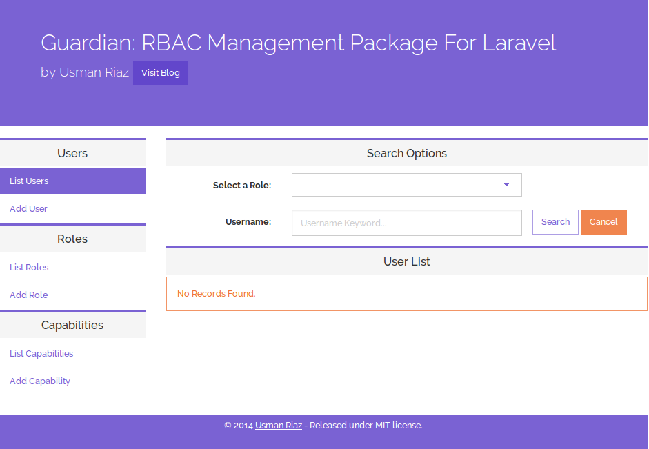

##Guardian: Role Based Access Control Package For Laravel 5 and 4 With Backend Interface

[](https://scrutinizer-ci.com/g/usm4n/guardian/?branch=master)
[](https://scrutinizer-ci.com/g/usm4n/guardian/build-status/master)
[](https://packagist.org/packages/usm4n/guardian)
[](https://packagist.org/packages/usm4n/guardian)
[](https://packagist.org/packages/usm4n/guardian) [](https://packagist.org/packages/usm4n/guardian)

###For Laravel 4 please switch to the [old branch](https://github.com/usm4n/guardian/tree/old) .

Guardian package for Laravel provides an easy interface to manage Role Based Access Control. Through its minimalist interface you can add users, roles and capabilities. Each user can be assigned multiple roles (many to many) and each role can be assigned multiple capabilities.

Guardian also comes with plenty of Access Control helper methods that make it easy to track access for a specific user inside your code.


##Installation and Setup

To install guardian, add the following lines in your `composer.json` file:
	
	"require-dev": {
		"usm4n/guardian": "dev-master"
	}

After adding the above lines, save the file and run:
	
    composer update --dev

After the successful completion of the composer installation process, add the following line to the `providers` array inside the `app/config/app.php` file:

	'Usman\Guardian\GuardianServiceProvider'

> If you have not already installed the `illuminate/html` package, then you will need to add the `Illuminate\Html\HtmlServiceProvider` into the `providers` array as well.

###Running Package Migrations

To setup the database for the guardian, you will need to run the following commands to run the package migration files:
	
	artisan vendor:publish --provider="Usman\Guardian\GuardianServiceProvider" --tag="guardian-migrations"

	artisan migrate

The first command will copy the package migration files into your installation's `database/migrations` directory. You can make your custom changes to any table before running the second command.

###Publishing View and Assets

Run the following `artisan` commands to publish the package assets and views into `public` and `resources/views` directory respectively.

	artisan vendor:publish --provider="Usman\Guardian\GuardianServiceProvider" --tag="guardian-assets"
	artisan vendor:publish --provider="Usman\Guardian\GuardianServiceProvider" --tag="guardian-views"

###Model Setup

Guardian requires you to have the following models inside your `app` directory: `User`, `Role` and `Capability`.

app/Role.php

```php
<?php namespace App;

use Illuminate\Database\Eloquent\Model;

class Role extends Model {

	public function users() 
    {
        return $this->belongsToMany('App\User');
    }

    public function capabilities()
    {
        return $this->belongsToMany('App\Capability');
    }

}
```
app/Capability.php

```php
<?php namespace App;

use Illuminate\Database\Eloquent\Model;

class Capability extends Model {

	
    public function roles()
    {
        return $this->belongsToMany('App\Role');
    }

}
```
The `User` model will require the following changes:

```php
...
use Usman\Guardian\AccessControl\AccessControlTrait;
use Usman\Guardian\AccessControl\AccessControlInterface;

class User extends Model implements AccessControlInterface, AuthenticatableContract, CanResetPasswordContract {

	use Authenticatable, CanResetPassword, AccessControlTrait;

```

Please note that, if your models are namespaced other then `App\`, you will need to reflect the changes in the package `config.php` file. You can use the following command to copy the package configuration file into your `app/config` directory:

	artisan vendor:publish --provider="Usman\Guardian\GuardianServiceProvider" --tag="guardian-config"

>Note: you can run the `artisan vendor:publish --provider="Usman\Guardian\GuardianServiceProvider"` command to publish all the package files at once.

vendor/usm4n/guardian/src/config/config.php

```php
<?php
return [
    'userModel' => 'App\User',
    'roleModel' => 'App\Role',
    'capabilityModel' => 'App\Capability',
];
```
After making the requested changes you will be able to access the guardian backend at `http://www.yoursite.com/guardian/backend`. The `auth` middleware is applied by default. So, you will need to log in first.

> In a development/local environment you can remove the `'middleware'=>'auth'` key value pair from the package's `routes.php` file for a test drive.



##Guardian Helpers

The following helper methods are available through `Guardian` Facade:

- `Guardian::hasRole($roleName)` - returns true if the current user has the role otherwise false will be returned.
- `Guardian::hasAnyRole(array $roleNames)` - returns true if user has any of the supplied roles otherwise false will be returned.
- `Guardian::hasAllRoles(array $rolesNames)` - returns true only if user has all the supplied roles otherwise false will be returned.
- `Guardian::hasCapability($capabilityName)` - returns true if the user has the supplied capability otherwise false will be returned.
- `Guardian::hasAnyCapability($capabilityNames)` - returns true if the user has any of the supplied capabilities otherwise false will be returned.
- `Guardian::hasAllCapabilities($capabilityNames)` - returns true if the user has all the supplied capabilities otherwise false will be returned.

##Help Resources For Laravel

- [Laravel docs](http://laravel.com/docs)
- [LaraCasts](https://laracasts.com/)
- [Laravel forum](http://laravel.io/forum)
- [Laravel Reddit](http://www.reddit.com/r/laravel/)

##Acknowledgements

- [Selectize.js](http://brianreavis.github.io/selectize.js/)
- [divshot/bootstrap-theme-white-plum](https://github.com/divshot/bootstrap-theme-white-plum)

##License

Guardian is a free software released under the terms of the MIT license.

##To-do list

- Code documentation.