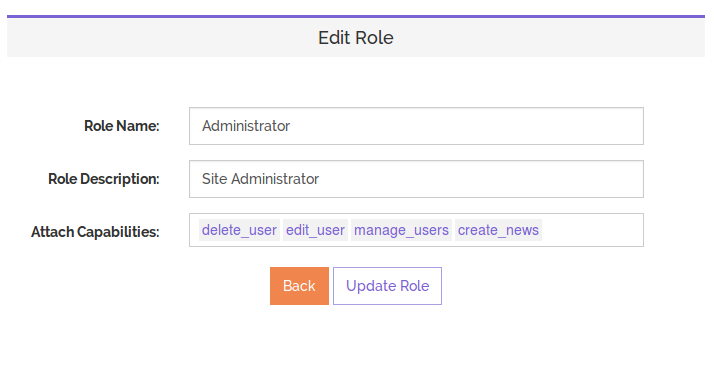

##Guardian: Role Based Access Control Package For Laravel With Backend Interface

Guardian package for Laravel provides an easy interface to manage Role Based Access Control. Through its minimalist interface you can add users, roles and capabilities. Each user can be assigned multiple roles (many to many) and each role can be assigned multiple capabilities.

Guardian also comes with plenty of Access Control helper methods that make it easy to track access for a specific user inside your code.



##Installation and Setup

To install guardian, add the following lines in your `composer.json` file:
	
	"require-dev": {
		"usm4n/guardian": "1.0"
	}

After adding the above lines, save the file and run:
	
    composer update --dev

After the successful completion of the composer installation process, add the following line to the `providers` array inside the `app/config/app.php' file:

	'Usman\Guardian\GuardianServiceProvider'

###Running Package Migrations

To setup the database for the guardian, you will need to run the following command to run the package migration files:

	artisan migrate --package="usm4n/guardian"

###Publishing Assets

Run the following `artisan` command to publish the package assets in `public` directory of your Laravel installation:

	artisan asset:publish 'usm4n/guardian

###Model Setup

Guardian requires you to have the following models inside your models directory: `User`, `Role` and `Capability`.

app/models/Role.php

```php
<?php

class Role extends Eloquent {
	
	public function users() 
	{
		return $this->belongsToMany('User');
	}

	public function capabilities()
	{
		return $this->belongsToMany('Capability');
	}

	public function setRoleNameAttribute($value)
	{
		$this->attributes['role_name'] = ucfirst($value);
	}
}
```
app/models/Capability.php

```php
<?php

class Capability extends Eloquent {
	
	public function roles()
	{
		return $this->belongsToMany('Role');
	}
}
```
The `User` model will require the following changes:

```php
...
use Usman\Guardian\AccessControl\AccessControlTrait;
use Usman\Guardian\AccessControl\AccessControlInterface;

class User extends Eloquent implements UserInterface, RemindableInterface, AccessControlInterface {

	use UserTrait, RemindableTrait, AccessControlTrait;
	...
}
```

> Please note that, if you want to place your model classes inside a custom `namespace`, reflect the changes in the package `config.php` file.

vendor/usm4n/guardian/src/config/config.php

```php
<?php
return [
    'userModel' => '\User',
    'roleModel' => '\Role',
    'capabilityModel' => '\Capability',
];
```
After making the requested changes you will be able to access the guardian backend at `http:/yoursite.com/guardian/backend`. The `auth` filter is applied by default. So, you will need to login first.

> In a development/local environment you can remove the `auth` filter from the package's `routes.php` file.


##Guardian Helpers

To be updated!

